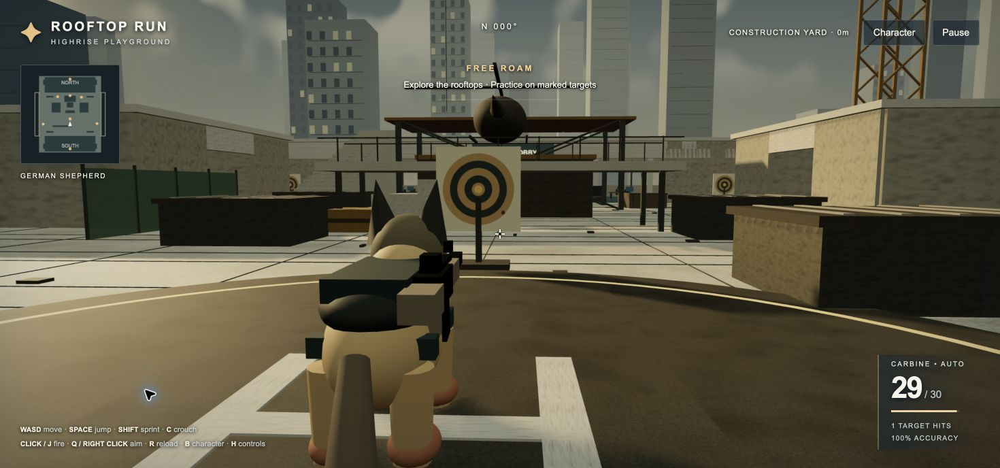
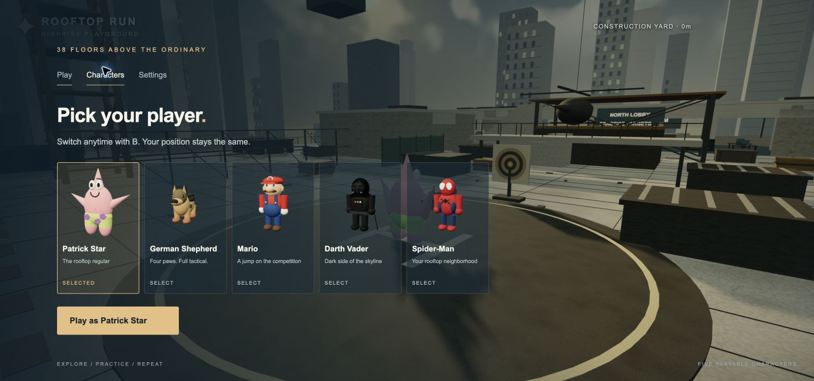

# Rooftop Run

A playable third-person browser game inspired by the rooftop construction setting of **MW2 Highrise**. Explore opposing office lobbies, climb onto rooftops, cross service catwalks, and practice with a rifle above a hazy city skyline.



## Play

Download **[rooftop-run.html](outputs/rooftop-run.html)** using GitHub's download button, then open it in a modern browser. The single-file version runs offline without installation or a server.

Desktop keyboard and mouse provide the full experience. Touch movement, jumping, and firing controls are also included. WebGL and hardware acceleration must be available.

## Characters

Press **B** or open **Characters** in the menu to switch between:

- Patrick Star
- German Shepherd, with a tactical harness and mounted rifle
- Mario
- Darth Vader
- Spider-Man

Switching preserves your position when there is sufficient headroom for the selected character.



## Features

- Two furnished lobbies with reception areas, desks, elevators, and exterior roof stairs.
- Construction platforms, two cranes, a helicopter, vents, scaffolding, and side catwalks.
- Third-person camera with aiming, shoulder swapping, and obstacle avoidance.
- Accelerated movement, sprinting, crouching, jumping, collision, and automatic falling respawn.
- Automatic rifle fire, a 30-round magazine, reload animation, muzzle flashes, tracers, impact marks, and hit feedback.
- Minimap, compass, accuracy tracking, atmospheric sound, footsteps, and weapon audio.
- Graphics presets, mouse sensitivity, sound controls, and reduced motion.

## Modes

**Free roam:** explore the level and practice on eight marked targets.

**90-second range drill:** hit all eight targets before the timer expires. Bullseyes award 100 points; other target hits award 50. The clock pauses with gameplay. Results show targets hit, points, and accuracy.

## Controls

- **WASD** — move
- **Mouse** — look; drag if pointer lock is unavailable
- **Space** — jump
- **Shift** — sprint
- **Hold C** — crouch
- **Left click / hold** — fire automatically
- **J** — fire a single shot
- **Right click / Q** — aim
- **R** — reload
- **V** — swap camera shoulders
- **B** — character selection
- **T** — return to the helipad
- **H** — show or hide control hints
- **Esc** — pause or resume

## Run the source locally

Requires Python 3:

```sh
git clone https://github.com/mattchante/rooftop-run.git
cd rooftop-run
python3 -m http.server 8765 --directory game/dist
```

Open **http://localhost:8765** in your browser. Editing files in `game/dist` updates this development version after a refresh. The downloadable HTML is a separate bundled snapshot.

## Project layout

- `game/dist/game.js` — world setup, movement, camera, input, and game loop
- `game/dist/expansion.js` — lobbies, expanded rooftop, props, and targets
- `game/dist/characters.js` — playable models, animation, and menu portraits
- `game/dist/shooting.js` — rifle handling, raycast hits, reloads, and effects
- `game/dist/polish.js` — scenery batching, atmosphere, audio, minimap, and range drill
- `game/dist/index.html` and `style.css` — interface and menus
- `game/dist/three.module.js` — vendored Three.js r170 engine
- `outputs/` — standalone playable build, screenshots, and quick-start instructions

Built with vanilla JavaScript, WebGL, and Three.js. Models, materials, sky, and audio are generated in code. Static scenery is batched to reduce rendering draw calls.

## About

This is an unofficial, stylized fan prototype with original geometry and procedural materials. It does not use extracted MW2 map assets and is not affiliated with the owners of the referenced games or characters. Three.js is distributed under the MIT license, as noted in the bundled engine's license header.
